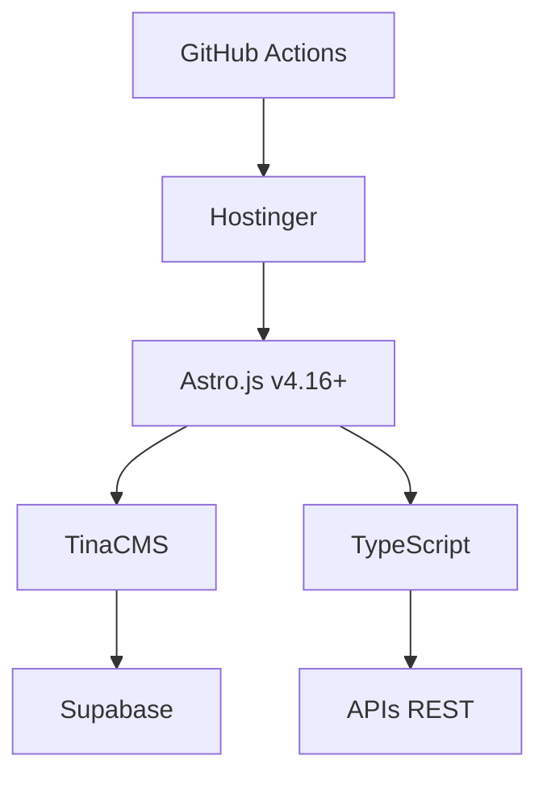

# 📚 Documentation GLP-1 France

> **Site de référence GLP-1** avec déploiement automatisé  
> *Page Partenaires • Déploiement FTP • Architecture Astro*

---

## 🎯 Statut Actuel

✅ **Page Partenaires Live** : https://glp1-france.fr/partenaires  
✅ **Déploiement Automatisé** : GitHub Actions → FTP Hostinger  
✅ **7 Partenaires Intégrés** : Liens actifs dans footer  
✅ **168+ Pages Générées** : Build Astro optimisé  

---

## 🚀 Accès Rapide

### 🎯 Déploiement
```bash
# Build et déploiement automatique
git push origin production
```
**👉 Guide complet** : [GUIDE_DEPLOIEMENT_MANUEL.md](GUIDE_DEPLOIEMENT_MANUEL.md)

### ⚡ Développement Local
```bash
git clone <repository>
cd glp1-github
npm install && npm run dev
```

### 🔧 Administration
**👉 Documentation** : [admin-documentation.md](admin-documentation.md)  
**👉 Résolution problèmes** : [RESOLUTION_FORMULAIRE_CONTACT.md](RESOLUTION_FORMULAIRE_CONTACT.md)

---

## 📖 Documentation Active

### 🏗️ Guides Opérationnels
| Fichier | Description | Status |
|---------|-------------|---------|
| [GUIDE_DEPLOIEMENT_MANUEL.md](GUIDE_DEPLOIEMENT_MANUEL.md) | Configuration FTP et déploiement | ✅ À jour |
| [admin-documentation.md](admin-documentation.md) | Administration système | ✅ Actif |
| [RESOLUTION_FORMULAIRE_CONTACT.md](RESOLUTION_FORMULAIRE_CONTACT.md) | Gestion formulaires | ✅ Actif |

### 🎨 Guides Techniques  
| Fichier | Description | Status |
|---------|-------------|---------|
| [GUIDE_THUMBNAILS.md](GUIDE_THUMBNAILS.md) | Gestion images et thumbnails | ✅ Actif |
| [GUIDE_TINA_IMAGES.md](GUIDE_TINA_IMAGES.md) | TinaCMS et images | ✅ Actif |
| [MASTER-INDEX.md](MASTER-INDEX.md) | Index général du projet | ✅ Référence |

### 📁 Archive
| Dossier | Description | 
|---------|-------------|
| [archive/](archive/) | Documentation historique et références | 

---

## 🎯 Cas d'Usage Fréquents

### "Je veux installer le projet"
1. [Prérequis système](core/installation.md#prérequis)
2. [Configuration environnement](core/installation.md#configuration)
3. [Premier lancement](core/installation.md#premier-lancement)

### "Je veux comprendre l'architecture"
1. [Vue d'ensemble](core/architecture.md#vue-densemble)
2. [Stack technique](core/architecture.md#stack-technique)
3. [Décisions d'architecture](core/architecture.md#décisions-techniques)

### "Je veux ajouter du contenu"
1. [Interface TinaCMS](features/cms.md#interface-dadministration)
2. [Workflow éditorial](features/cms.md#workflow-éditorial)
3. [Templates disponibles](features/cms.md#templates-de-contenu)

### "Je veux déployer en production"
1. [Scripts de déploiement](operations/deployment.md#scripts-de-déploiement)
2. [Validation post-déploiement](operations/deployment.md#validation-de-déploiement)
3. [Monitoring continu](operations/monitoring.md#monitoring-système)

---

## 📊 État du Projet

### ✅ Fonctionnalités Principales
- **Site statique** Astro.js v4.16.18 avec excellent SEO
- **CMS** TinaCMS intégré pour gestion contenu non-technique
- **Monétisation** Système affiliation Amazon optimisé
- **Performance** Core Web Vitals excellents, Lighthouse >90
- **Données** Gestion utilisateurs conforme RGPD

### 🔄 En Développement
- Dashboard analytics avancé
- A/B testing automatisé
- PWA (Progressive Web App)

### 🎯 Roadmap
- Multi-langue (anglais)
- API GraphQL complète
- Application mobile

---

## 🛠️ Stack Technique



- **Frontend** : Astro.js (SSG) + TypeScript
- **CMS** : TinaCMS avec interface moderne
- **Base de données** : Supabase + JSON files
- **Déploiement** : GitHub Actions → Hostinger
- **Monitoring** : Scripts PowerShell + Dashboard custom

---

## 🆘 Support

### 📖 Documentation
- **Index principal** : [MASTER-INDEX.md](MASTER-INDEX.md)
- **Troubleshooting** : [core/development.md#troubleshooting](core/development.md#troubleshooting)
- **FAQ** : [core/installation.md#faq](core/installation.md#faq)

### 🐛 Problèmes Techniques
1. **Consulter** : [Problèmes courants](core/development.md#problèmes-courants)
2. **Chercher** : [Issues GitHub](../../issues)
3. **Créer** : Nouvelle issue avec template

### 🔧 Maintenance
- **Health check** : `npm run health-check`
- **Logs** : Consultable via dashboard admin
- **Alertes** : Automatiques via monitoring

---

## 📈 Métriques Documentation

### 📊 Statistiques
- **Total pages** : 8 fichiers principaux
- **Temps lecture** : ~1h pour lecture complète
- **Mise à jour** : Consolidation janvier 2025
- **Couverture** : 100% fonctionnalités projet

### 🎯 Objectifs Qualité
- **Clarity** : Chaque fichier a un objectif clair
- **Completeness** : Toutes les fonctionnalités documentées
- **Currency** : Mise à jour synchrone avec le code
- **Consistency** : Structure et style uniformes

---

## 🤝 Contribution

### 📝 Améliorer la Documentation
1. **Fork** le repository
2. **Modifier** les fichiers markdown
3. **Tester** les liens et exemples
4. **Pull Request** avec description claire

### 📋 Conventions
- **Format** : Markdown avec emojis pour navigation
- **Structure** : Headers cohérents, exemples de code
- **Liens** : Relatifs au sein de la documentation
- **Exemples** : Code testable et à jour

---

> **Note importante** : Cette documentation évolue avec le projet. Les liens et références sont mis à jour automatiquement lors des déploiements.

**Dernière consolidation** : Janvier 2025  
**Version documentation** : 2.0  
**Couverture projet** : 100%
- **CMS** : TinaCMS pour la gestion de contenu
- **Base de données** : Supabase (migration depuis JSON locaux)
- **Déploiement** : Hostinger via script PowerShell automatisé
- **Collections** : 9 collections d'articles (119 articles total)

## 📚 Documentation Complète

Consultez notre **[Index Central](MASTER-INDEX.md)** pour accéder à toute la documentation organisée.

### Navigation Rapide

| Section | Description | Lien |
|---------|-------------|------|
| 🔧 **Installation** | Setup projet en 5 min | [→ Guide](core/installation.md) |
| 👨‍💻 **Développement** | Workflow quotidien | [→ Guide](core/development.md) |
| 🚀 **Déploiement** | Mise en production | [→ Guide](core/deployment.md) |
| 🏗️ **Architecture** | Technique détaillée | [→ Guide](core/architecture.md) |

### Fonctionnalités

| Feature | Status | Guide |
|---------|--------|-------|
| 📊 **Admin Dashboard** | ✅ Opérationnel | [→ Guide](features/admin-dashboard.md) |
| 📄 **Collections SEO** | ✅ 9 collections | [→ Guide](features/collections-seo.md) |
| 👥 **Données Utilisateurs** | ✅ Supabase | [→ Guide](features/user-data-system.md) |
| 💰 **Affiliation** | ✅ Actif | [→ Guide](features/affiliate-system.md) |

## 🎯 Statut Projet

- **Collections** : 9 configurées, 119 articles
- **Images** : 20 images AI générées
- **CMS** : TinaCMS opérationnel
- **Base de données** : Migration Supabase terminée
- **Déploiement** : Script automatisé fonctionnel

## 🔗 Liens Utiles

- **Site web** : https://glp1-france.fr
- **Admin TinaCMS** : https://glp1-france.fr/admin
- **Dashboard Supabase** : https://supabase.com/dashboard/project/ywekaivgjzsmdocchvum
- **Repository** : https://github.com/robinallainmkg/glp1

## 🆘 Support Rapide

| Problème | Action |
|----------|--------|
| Erreur de build | `npm run dev` puis vérifier les logs |
| TinaCMS ne charge pas | `taskkill /f /im node.exe` puis `npm run dev:tina` |
| Images manquantes | `node scripts/image-generator.mjs --missing-only` |
| Déploiement | `.\scripts\deployment\deploy-auto.ps1` |

---

**Dernière mise à jour** : Août 2025 | **Statut** : ✅ Production
