# Système de Contenu TinaCMS - GLP-1 France

## 📋 Vue d'ensemble

Documentation complète du système de gestion de contenu basé sur TinaCMS, incluant la configuration, les collections, et la gestion des médias.

## 🎯 Architecture TinaCMS

### Configuration Principale

```typescript
// tina/config.ts
import { defineConfig } from "tinacms";

export default defineConfig({
  branch: "main",
  clientId: "d2c40213-494b-4005-94ad-b601dbdf1f0e",
  token: process.env.TINA_TOKEN,
  
  build: {
    outputFolder: "admin",
    publicFolder: "public",
  },
  
  media: {
    tina: {
      mediaRoot: "uploads",
      publicFolder: "public",
    },
  },
  
  schema: {
    collections: [
      // Collections définies ci-dessous
    ],
  },
});
```

### Collections Structure

```typescript
// Collections principales
const collections = [
  {
    name: "medicaments_glp1",
    label: "Médicaments GLP-1",
    path: "src/content/medicaments-glp1",
    format: "mdx",
    ui: {
      router: ({ document }) => `/collections/medicaments-glp1/${document._sys.filename}`,
    },
    fields: [
      {
        type: "string",
        name: "title",
        label: "Titre",
        isTitle: true,
        required: true,
      },
      {
        type: "string",
        name: "description",
        label: "Description",
        ui: {
          component: "textarea",
        },
      },
      {
        type: "image",
        name: "featured_image",
        label: "Image mise en avant",
      },
      {
        type: "string",
        name: "category",
        label: "Catégorie",
        options: [
          { value: "semaglutide", label: "Sémaglutide" },
          { value: "liraglutide", label: "Liraglutide" },
          { value: "dulaglutide", label: "Dulaglutide" },
          { value: "comparison", label: "Comparaison" },
        ],
      },
      {
        type: "object",
        name: "seo",
        label: "SEO",
        fields: [
          {
            type: "string",
            name: "meta_title",
            label: "Meta Title",
          },
          {
            type: "string",
            name: "meta_description",
            label: "Meta Description",
            ui: {
              component: "textarea",
            },
          },
          {
            type: "string",
            name: "canonical_url",
            label: "URL Canonique",
          },
        ],
      },
      {
        type: "rich-text",
        name: "body",
        label: "Contenu",
        isBody: true,
        templates: [
          {
            name: "AffiliateProduct",
            label: "Produit Affilié",
            fields: [
              {
                type: "string",
                name: "product_id",
                label: "ID Produit",
                required: true,
              },
              {
                type: "string",
                name: "placement",
                label: "Placement",
                options: ["inline", "sidebar", "footer"],
              },
            ],
          },
          {
            name: "ExpertQuote",
            label: "Citation Expert",
            fields: [
              {
                type: "string",
                name: "expert_name",
                label: "Nom de l'expert",
                required: true,
              },
              {
                type: "string",
                name: "expert_title",
                label: "Titre de l'expert",
              },
              {
                type: "image",
                name: "expert_photo",
                label: "Photo de l'expert",
              },
              {
                type: "rich-text",
                name: "quote",
                label: "Citation",
                required: true,
              },
            ],
          },
          {
            name: "InfoBox",
            label: "Boîte d'information",
            fields: [
              {
                type: "string",
                name: "type",
                label: "Type",
                options: [
                  { value: "info", label: "Information" },
                  { value: "warning", label: "Attention" },
                  { value: "success", label: "Succès" },
                  { value: "danger", label: "Danger" },
                ],
              },
              {
                type: "string",
                name: "title",
                label: "Titre",
              },
              {
                type: "rich-text",
                name: "content",
                label: "Contenu",
                required: true,
              },
            ],
          },
        ],
      },
    ],
  },
  
  {
    name: "glp1_perte_de_poids",
    label: "GLP-1 Perte de Poids",
    path: "src/content/glp1-perte-de-poids",
    format: "mdx",
    // Configuration similaire...
  },
  
  {
    name: "experts",
    label: "Experts",
    path: "src/content/experts",
    format: "mdx",
    fields: [
      {
        type: "string",
        name: "name",
        label: "Nom complet",
        isTitle: true,
        required: true,
      },
      {
        type: "string",
        name: "title",
        label: "Titre professionnel",
        required: true,
      },
      {
        type: "string",
        name: "specialization",
        label: "Spécialisation",
        options: [
          "Endocrinologie",
          "Nutrition",
          "Médecine Générale",
          "Diabétologie",
        ],
      },
      {
        type: "image",
        name: "photo",
        label: "Photo professionnelle",
      },
      {
        type: "string",
        name: "experience_years",
        label: "Années d'expérience",
        ui: {
          component: "number",
        },
      },
      {
        type: "object",
        name: "credentials",
        label: "Diplômes et Certifications",
        list: true,
        fields: [
          {
            type: "string",
            name: "degree",
            label: "Diplôme",
          },
          {
            type: "string",
            name: "institution",
            label: "Institution",
          },
          {
            type: "string",
            name: "year",
            label: "Année",
          },
        ],
      },
      {
        type: "string",
        name: "linkedin_url",
        label: "LinkedIn",
      },
      {
        type: "rich-text",
        name: "bio",
        label: "Biographie",
        isBody: true,
      },
    ],
  },
];
```

## 🖼️ Gestion des Médias

### Configuration Images

```typescript
// Configuration media dans tina/config.ts
media: {
  tina: {
    mediaRoot: "uploads",
    publicFolder: "public",
    static: false,
  },
},

// Accepter différents formats
accept: ["image/*", "application/pdf"],

// Taille maximale
maxSize: 5 * 1024 * 1024, // 5MB
```

### Organisation des Dossiers

```
public/
├── images/
│   ├── uploads/           # Images via TinaCMS
│   │   ├── articles/      # Images d'articles
│   │   ├── experts/       # Photos d'experts
│   │   ├── products/      # Images produits
│   │   └── misc/          # Divers
│   ├── thumbnails/        # Thumbnails auto-générées
│   ├── experts/           # Photos experts fixes
│   └── og/               # Images Open Graph
```

### Composant Image Optimisé

```astro
---
// components/OptimizedImage.astro
interface Props {
  src: string;
  alt: string;
  width?: number;
  height?: number;
  class?: string;
  loading?: 'lazy' | 'eager';
  sizes?: string;
}

const { 
  src, 
  alt, 
  width, 
  height, 
  class: className = '',
  loading = 'lazy',
  sizes = '(max-width: 768px) 100vw, 50vw'
} = Astro.props;

// Détection si image TinaCMS ou locale
const isUploadedImage = src.startsWith('/uploads/') || src.startsWith('/images/uploads/');
const imageSrc = isUploadedImage ? `/images${src}` : src;

// Générer différentes tailles si nécessaire
const generateSrcSet = (baseSrc: string) => {
  if (!isUploadedImage) return '';
  
  const sizes = [320, 640, 768, 1024, 1280];
  return sizes
    .map(size => `${baseSrc}?w=${size} ${size}w`)
    .join(', ');
};

const srcSet = generateSrcSet(imageSrc);
---


<style>
  img {
    max-width: 100%;
    height: auto;
    border-radius: 8px;
  }
</style>
```

## ✍️ Templates de Contenu

### Template Article Standard

```astro
---
// templates/ArticleTemplate.astro
import { type CollectionEntry } from 'astro:content';
import BaseLayout from '../layouts/BaseLayout.astro';
import ExpertQuote from '../components/ExpertQuote.astro';
import InfoBox from '../components/InfoBox.astro';
import AffiliateProduct from '../components/AffiliateProduct.astro';

interface Props {
  article: CollectionEntry<'medicaments_glp1'>;
}

const { article } = Astro.props;
const { Content, components } = await article.render();

// Composants personnalisés pour MDX
const mdxComponents = {
  ExpertQuote,
  InfoBox,
  AffiliateProduct,
  // Composants HTML enrichis
  h2: (props: any) => <h2 class="article-heading-2" {...props} />,
  h3: (props: any) => <h3 class="article-heading-3" {...props} />,
  p: (props: any) => <p class="article-paragraph" {...props} />,
  ul: (props: any) => <ul class="article-list" {...props} />,
  blockquote: (props: any) => <blockquote class="article-quote" {...props} />,
};
---

<BaseLayout 
  title={article.data.seo?.meta_title || article.data.title}
  description={article.data.seo?.meta_description || article.data.description}
  image={article.data.featured_image}
  canonicalURL={article.data.seo?.canonical_url}
>
  <article class="article-content">
    <header class="article-header">
      <h1 class="article-title">{article.data.title}</h1>
      
      {article.data.description && (
        <p class="article-description">{article.data.description}</p>
      )}
      
      {article.data.featured_image && (
        <OptimizedImage
          src={article.data.featured_image}
          alt={article.data.title}
          class="article-featured-image"
        />
      )}
    </header>
    
    <div class="article-body">
      <Content components={mdxComponents} />
    </div>
    
    <footer class="article-footer">
      <!-- Partage social, navigation, etc. -->
    </footer>
  </article>
</BaseLayout>

<style>
  .article-content {
    max-width: 800px;
    margin: 0 auto;
    padding: 2rem 1rem;
  }
  
  .article-title {
    font-size: 2.5rem;
    font-weight: 700;
    line-height: 1.2;
    margin-bottom: 1rem;
    color: #1f2937;
  }
  
  .article-description {
    font-size: 1.25rem;
    color: #6b7280;
    line-height: 1.6;
    margin-bottom: 2rem;
  }
  
  .article-featured-image {
    width: 100%;
    height: 400px;
    object-fit: cover;
    margin-bottom: 2rem;
    border-radius: 12px;
  }
  
  .article-body {
    line-height: 1.8;
    color: #374151;
  }
  
  .article-body :global(.article-heading-2) {
    font-size: 2rem;
    font-weight: 600;
    margin: 3rem 0 1.5rem 0;
    color: #1f2937;
    border-bottom: 2px solid #e5e7eb;
    padding-bottom: 0.5rem;
  }
  
  .article-body :global(.article-heading-3) {
    font-size: 1.5rem;
    font-weight: 600;
    margin: 2rem 0 1rem 0;
    color: #1f2937;
  }
  
  .article-body :global(.article-paragraph) {
    margin-bottom: 1.5rem;
  }
  
  .article-body :global(.article-list) {
    margin: 1.5rem 0;
    padding-left: 2rem;
  }
  
  .article-body :global(.article-list li) {
    margin-bottom: 0.5rem;
  }
  
  .article-body :global(.article-quote) {
    border-left: 4px solid #3b82f6;
    padding-left: 1.5rem;
    margin: 2rem 0;
    font-style: italic;
    background: #f8fafc;
    padding: 1.5rem;
    border-radius: 8px;
  }
  
  @media (max-width: 768px) {
    .article-title {
      font-size: 2rem;
    }
    
    .article-content {
      padding: 1rem;
    }
  }
</style>
```

### Composants Rich Text

```astro
---
// components/ExpertQuote.astro
interface Props {
  expert_name: string;
  expert_title?: string;
  expert_photo?: string;
  quote: string;
}

const { expert_name, expert_title, expert_photo, quote } = Astro.props;
---

<div class="expert-quote">
  <div class="expert-quote__content">
    <div class="expert-quote__text" set:html={quote} />
  </div>
  
  <div class="expert-quote__author">
    {expert_photo && (
      
    )}
    
    <div class="expert-quote__info">
      <cite class="expert-quote__name">{expert_name}</cite>
      {expert_title && (
        <p class="expert-quote__title">{expert_title}</p>
      )}
    </div>
  </div>
</div>

<style>
  .expert-quote {
    background: linear-gradient(135deg, #f0f9ff, #e0f2fe);
    border: 1px solid #bae6fd;
    border-radius: 12px;
    padding: 2rem;
    margin: 2rem 0;
    position: relative;
  }
  
  .expert-quote::before {
    content: '"';
    position: absolute;
    top: -10px;
    left: 20px;
    font-size: 4rem;
    color: #0ea5e9;
    font-family: serif;
    line-height: 1;
  }
  
  .expert-quote__content {
    margin-bottom: 1.5rem;
  }
  
  .expert-quote__text {
    font-size: 1.1rem;
    line-height: 1.6;
    color: #1e40af;
    font-style: italic;
  }
  
  .expert-quote__author {
    display: flex;
    align-items: center;
    gap: 1rem;
  }
  
  .expert-quote__photo {
    width: 60px;
    height: 60px;
    border-radius: 50%;
    object-fit: cover;
    border: 3px solid #0ea5e9;
  }
  
  .expert-quote__name {
    font-weight: 600;
    color: #1e40af;
    font-style: normal;
    display: block;
  }
  
  .expert-quote__title {
    color: #0369a1;
    font-size: 0.9rem;
    margin: 0;
  }
</style>
```

```astro
---
// components/InfoBox.astro
interface Props {
  type: 'info' | 'warning' | 'success' | 'danger';
  title?: string;
  content: string;
}

const { type, title, content } = Astro.props;

const typeConfig = {
  info: {
    icon: 'ℹ️',
    bgColor: '#dbeafe',
    borderColor: '#3b82f6',
    textColor: '#1e40af'
  },
  warning: {
    icon: '⚠️',
    bgColor: '#fef3c7',
    borderColor: '#f59e0b',
    textColor: '#92400e'
  },
  success: {
    icon: '✅',
    bgColor: '#d1fae5',
    borderColor: '#10b981',
    textColor: '#065f46'
  },
  danger: {
    icon: '🚨',
    bgColor: '#fee2e2',
    borderColor: '#ef4444',
    textColor: '#991b1b'
  }
};

const config = typeConfig[type];
---

<div 
  class="info-box"
  style={`
    background-color: ${config.bgColor};
    border-left-color: ${config.borderColor};
    color: ${config.textColor};
  `}
>
  <div class="info-box__header">
    <span class="info-box__icon">{config.icon}</span>
    {title && <h4 class="info-box__title">{title}</h4>}
  </div>
  
  <div class="info-box__content" set:html={content} />
</div>

<style>
  .info-box {
    border-left: 4px solid;
    padding: 1.5rem;
    margin: 2rem 0;
    border-radius: 8px;
  }
  
  .info-box__header {
    display: flex;
    align-items: center;
    gap: 0.5rem;
    margin-bottom: 1rem;
  }
  
  .info-box__icon {
    font-size: 1.25rem;
  }
  
  .info-box__title {
    margin: 0;
    font-size: 1.1rem;
    font-weight: 600;
  }
  
  .info-box__content {
    line-height: 1.6;
  }
  
  .info-box__content :global(p) {
    margin: 0;
  }
  
  .info-box__content :global(p + p) {
    margin-top: 1rem;
  }
</style>
```

## 🔧 Workflow Éditorial

### Interface d'Administration

1. **Accès** : `/admin` (protégé par authentification TinaCMS)
2. **Collections** : Navigation par type de contenu
3. **Éditeur** : Interface WYSIWYG avec aperçu temps réel
4. **Médias** : Gestionnaire d'images intégré
5. **Prévisualisation** : Voir les changements avant publication

### Process de Publication

```mermaid
graph LR
  A[Création] --> B[Rédaction]
  B --> C[Ajout Images]
  C --> D[SEO]
  D --> E[Prévisualisation]
  E --> F[Publication]
  F --> G[Déploiement Auto]
```



### Validation et SEO

```typescript
// Validation automatique lors de la sauvegarde
const validateContent = (data: any) => {
  const errors = [];
  
  // Titre requis et longueur
  if (!data.title || data.title.length < 10) {
    errors.push('Titre trop court (minimum 10 caractères)');
  }
  
  if (data.title && data.title.length > 60) {
    errors.push('Titre trop long (maximum 60 caractères)');
  }
  
  // Meta description
  if (!data.seo?.meta_description) {
    errors.push('Meta description manquante');
  } else if (data.seo.meta_description.length > 160) {
    errors.push('Meta description trop longue (maximum 160 caractères)');
  }
  
  // Image mise en avant
  if (!data.featured_image) {
    errors.push('Image mise en avant manquante');
  }
  
  return errors;
};
```

## 🚀 Performance et Cache

### Génération Statique

```typescript
// astro.config.mjs optimisations
export default defineConfig({
  output: 'static',
  build: {
    inlineStylesheets: 'auto',
    assets: '_assets',
  },
  image: {
    service: squooshImageService(),
  },
  vite: {
    build: {
      cssCodeSplit: false,
      rollupOptions: {
        output: {
          manualChunks: {
            tinacms: ['tinacms'],
          }
        }
      }
    }
  }
});
```

### Cache Strategy

1. **Images** : Versioning automatique, cache long terme
2. **CSS/JS** : Hash-based naming, cache immutable  
3. **HTML** : Cache court, revalidation fréquente
4. **API TinaCMS** : Cache en mémoire, invalidation smart

---

> **Note** : TinaCMS permet une gestion de contenu moderne avec une expérience développeur optimale et une interface utilisateur intuitive.
